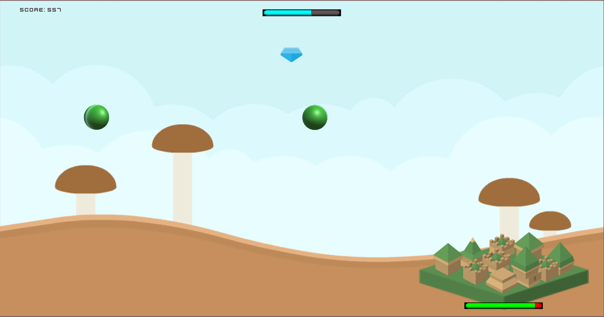
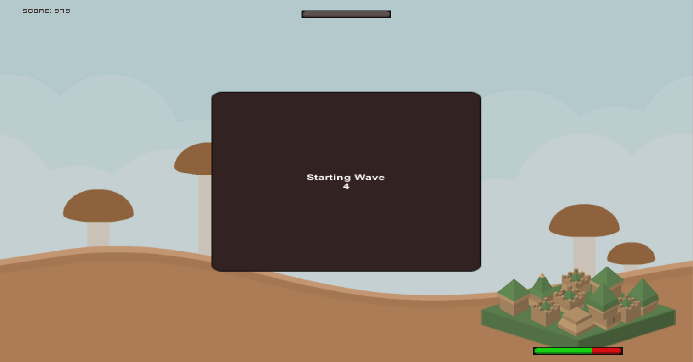
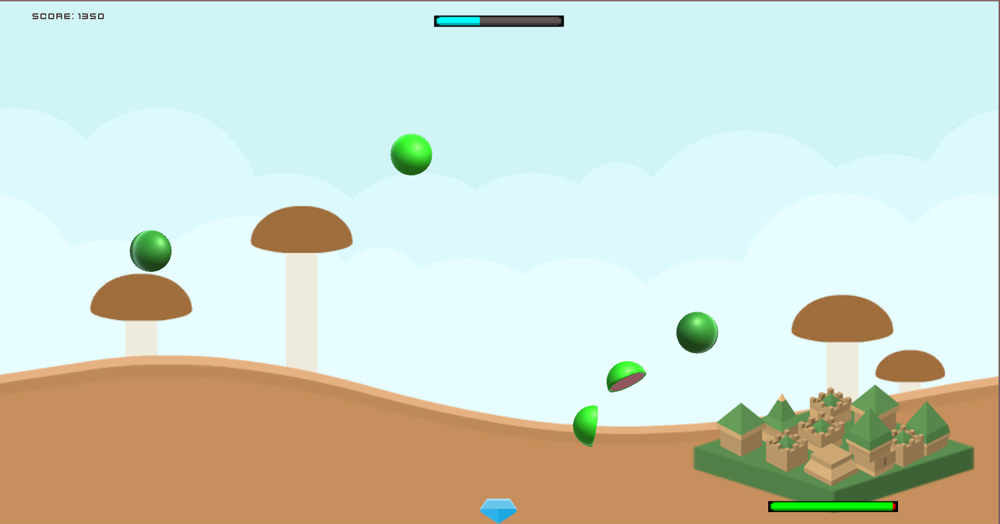
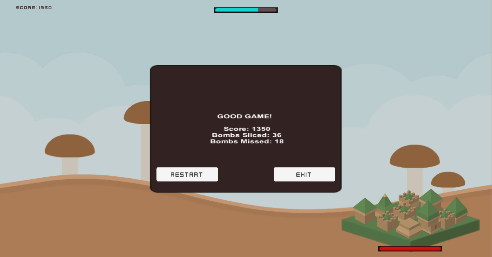

# CityDefense
Created the game CityDefense in Unity.

The game is a combination of Fruit Ninja and Tower Defense.
The goal is to protect the city by slashing the different bombs spawned at it.
Once the city is destroyed, the game is over.
The game gets harder as you get better but no worries - you also get more boosters.

Game development is my passion and I created this game for fun and personal growth.
I'm a developer and independently worked on this game so the graphical aspects of the game are basic.

<a href="https://meirshomron.github.io/MakingOfCityDefense.html">Making Of CityDefense Article</a>

## Game Flow

## Future Possible Upgrades
- Update all the graphics.
- Sounds.
- Start game screen.
- Saving a score board.
- Animation of award added amount.
- Explosion animation when the bomb hits the city.
- More cities, bombs and boosters.
- In-game pause, resume and settings buttons.
- Create a mobile version - currently it's written for PC.

##  Images:

