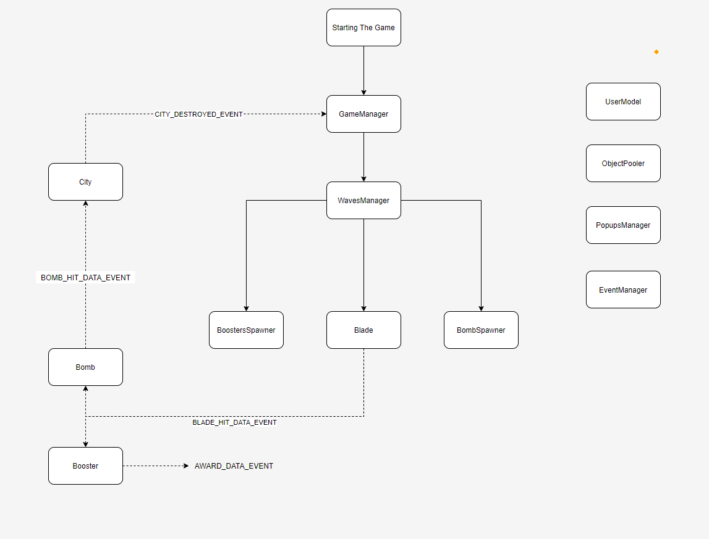

# CityDefense
Created the game CityDefense in Unity.

The game is a combination of fruit ninja and tower defense.
The goal is to protect the city by slashing the different bombs spawned at it.
Once the city is destroyed, the game is over.
The game gets harder as you get better but no worries - you also get more boosters.

Game development is my passion and this game was created for fun and persenal development.
I'm a developer and I worked on this game alone so the graphical aspect of the game is as basic as you can see.

## Game Flow

## Future Possible Upgrades
- Update all the graphics.
- Sounds.
- Start game screen.
- Saving a score board.
- Animation of award added amount.
- Explosion animation when the bomb hits the city.
- More cities.
- In-game pause, resume and settings buttons.
- Create a mobile version - currently it's written for PC.

##  Images:

